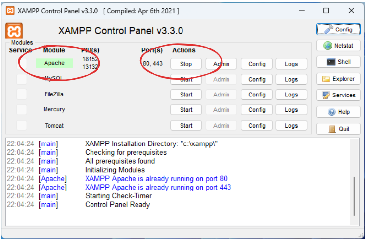

# Trabalho 2º Bim
Trabalho de Introdução ao Desenvolvimento Web e Modelagem de Banco de Dados

## Contextualização

Dona Marocas é uma entusiasta das tecnologias modernas e, para compartilhar seu amor pelos chás, bolos e doces, decidiu digitalizar suas receitas. Ela deseja criar um sistema que permita cadastrar e exibir suas receitas de maneira simples, eficiente e bonita.

## Objetivo do Trabalho:
Desenvolver um sistema web para cadastrar e exibir receitas de Dona Marocas, integrando modelagem de banco de dados e desenvolvimento web, conforme os elementos especificados.

## Elementos do Trabalho:

### Modelagem de Banco de Dados
1. Criação de um Diagrama Entidade-Relacionamento (ER) que contenha, no mínimo, 3 a 4 tabelas. Sugestão de tabelas:

- `Receitas`: informações como título, descrição, ingredientes, tempo de preparo, categoria (bolo, doce, etc.).
- `Ingredientes`: lista de ingredientes com nome, quantidade e unidade.
- `Categorias`: classificação das receitas (ex: bolos, doces, biscoitos).
- `Comentários`: avaliações ou comentários de usuários sobre as receitas (opcional, caso desejado).

2. Criar o esquema lógico do banco de dados no BRModelo.
3. Gerar e exportar o script SQL para criar o banco de dados no MySQL ou MariaDB.

Na hora de desenvolver o front e o back, pode usar uma tabela só no banco e salvar tudo em uma só

### Desenvolvimento Front-End
1. Criar uma interface web com HTML, CSS e JavaScript que permita o cadastro de novas receitas e exibição das receitas cadastradas.
1. As páginas devem ser funcionais e esteticamente agradáveis, usando boas práticas de acessibilidade e responsividade.

### Desenvolvimento Back-End
1. Criar um back-end em PHP que possibilite:

- Cadastro das receitas no banco de dados.
- Retorno dos dados das receitas para o front-end (exibição).
- Validação dos dados recebidos (ex.: campos obrigatórios preenchidos).

## Perguntas Frequentemente Perguntadas (FAQ)

### Meu sistema vai ter que inserir dados em todas as tabelas?
Não. Para esse trabalho se salvar e recuperar as receitas, está bom.

### Você vai avaliar o SQL?
Não. O SQL vai ser gerado pelo BRModelo, então ele vai servir apenas para a gente gerar o banco.

## Entrega:

- Diagrama ER e esquema lógico no BRModelo.
- Script SQL do banco de dados.
- Código fonte do front-end e back-end em um repositório ou pasta compactada para envio.

## Critérios de Avaliação:

- Completude e consistência do modelo de banco de dados.
- Funcionalidade e estética da interface do front-end.
- Correto funcionamento do back-end e integração com o banco de dados.
- Boas práticas de programação e documentação do código.

## Como rodar o PHP

- Instale o [XAMPP](https://www.apachefriends.org/pt_br/index.html) (se já não tiver instalado)
- Execute o Apache (clique no botão "start" e espere o Apache ficar verdinho)

- Localize a pasta `c:\xampp\htdocs`
- Crie dentro dela uma pasta sua (pode ser com seu nome)
- Coloque os arquivos do projeto nessa pasta
- Abra o navegador (qualquer um) e digite o endereço: `localhost/nome-da-pasta-que-voce-criou`

Boa sorte na criação do sistema da Dona Marocas! 🍰 ☕
